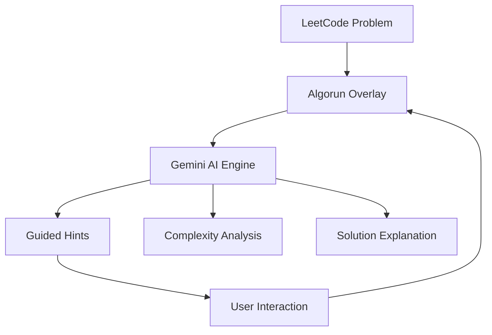

#  Algorun

**AI-powered tutoring overlay for LeetCode.** Get step-by-step solutions, explanations, and learning insights while you solve problems on `leetcode.com`.

<p align="center">
  
  
</p>

---

## 🧪 System Architecture



## 🚀 Key Features

- **Context Awareness**: Automatically extracts active problem description, selected programming language, and your Monaco editor code directly from the page.
- **Guided Socratic Hints**: Nudges you toward the answer without spoiling the solution.
- **Complexity Breakdown**: Instant Big-O analysis for time and space complexity.
- **Pattern Recognition**: Identify algorithmic paradigms (Two Pointers, Sliding Window, DP, DFS/BFS).
- **Interactive Chat**: Real-time AI streaming responses powered by Google Gemini.
- **Client-Side Security**: Gemini API keys are encrypted with AES-GCM via the Web Crypto API before being stored locally.

## 🛠️ Project Structure

```
algo-run-leetcode-tutor/
├── assets/                  # Landing page assets (CSS, JS, icons)
│   ├── css/style.css
│   ├── js/main.js
│   └── icons/
├── chrome-extension/        # Core Chrome extension source
│   ├── public/              # Manifest icons, logos, demos
│   ├── src/
│   │   ├── components/      # FloatingChatBox, MarkdownRenderer
│   │   ├── content/         # Content script injected into LeetCode
│   │   ├── hooks/           # useSessionStorage
│   │   ├── lib/             # Encryption, Gemini model, prompt, types
│   │   ├── popup/           # Extension settings & API key manager
│   │   └── sidepanel/       # Extension sidepanel view
│   ├── manifest.config.ts
│   └── vite.config.ts
├── .github/                 # Workflows and issue/PR templates
└── index.html               # Algorun landing page
```

## 🏁 Getting Started

### Prerequisites

- Node.js >= 20
- pnpm >= 9

### Extension Setup & Build

1. **Clone the repository:**
   ```bash
   git clone https://github.com/ichshakib/algo-run-leetcode-tutor.git
   cd algo-run-leetcode-tutor
   ```

2. **Navigate to the extension directory and install dependencies:**
   ```bash
   cd chrome-extension
   pnpm install
   ```

3. **Start development server:**
   ```bash
   pnpm dev
   ```

4. **Build production bundle:**
   ```bash
   pnpm build
   ```
   This generates the unpacked extension in `dist/` and a ready-to-distribute ZIP archive in `release/`.

5. **Load Extension in Chrome:**
   - Navigate to `chrome://extensions` in Google Chrome.
   - Enable **Developer mode** (top right switch).
   - Click **Load unpacked** and select the `chrome-extension/dist` folder (or drag and drop the release `.zip`).

6. **Configure Gemini API Key:**
   - Click the Algorun extension icon in the Chrome toolbar.
   - Enter your Google Gemini API Key (get one for free at [Google AI Studio](https://aistudio.google.com/app/apikey)).
   - Click **Save Changes**.

## 🌐 Landing Page

To preview the landing page locally:
- Simply open [index.html](index.html) in your browser, or serve it with any static server:
  ```bash
  npx serve .
  ```

## 🤝 How to Contribute

We welcome contributions! Please see our [CONTRIBUTING.md](CONTRIBUTING.md) and adhere to our [CODE_OF_CONDUCT.md](CODE_OF_CONDUCT.md).

## ⚖️ License

This project is licensed under the MIT License - see the [LICENSE](LICENSE) file for details.