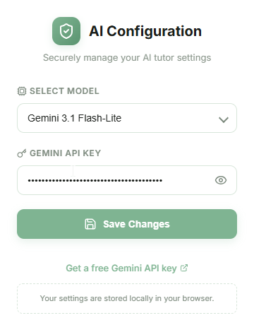
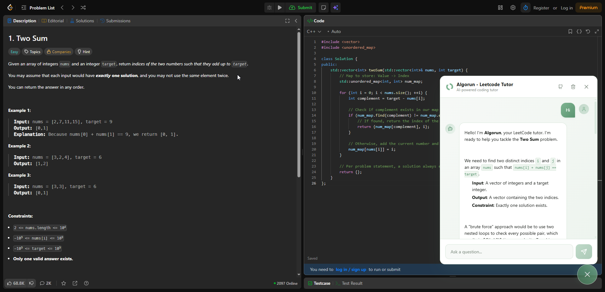

# Algorun - LeetCode AI Tutor (Chrome Extension)

Algorun is an AI-powered tutoring overlay designed for LeetCode. It injects directly into LeetCode problem solving pages (`https://leetcode.com/problems/*`), dynamically extracts the problem description and your active editor code, and offers intelligent, step-by-step guidance without giving away spoilers.

<p align="center">
  
  
</p>

## ✨ Highlights

- **Direct In-Page Integration**: A lightweight floating action button and chatbox overlay on LeetCode problem pages.
- **Context-Aware Assistance**: Extracts the problem description, active programming language, and Monaco code editor lines automatically.
- **Socratic Tutoring Style**: Formatted to guide learning, identify algorithmic patterns, and analyze Big-O complexity instead of bluntly pasting answers.
- **Gemini Streaming Responses**: Real-time response streaming with animated thinking feedback and syntax-highlighted markdown code blocks.
- **Encrypted Local Storage**: Encrypts your Google Gemini API key with AES-GCM (Web Crypto API) before saving to local browser storage.
- **Session Persistence**: Debounced chat history cached per problem session.

## 🛠️ Tech Stack

- **Framework**: [React 19](https://react.dev/), [TypeScript](https://www.typescriptlang.org/)
- **Bundler & Extension Tooling**: [Vite](https://vitejs.dev/) + [@crxjs/vite-plugin](https://crxjs.dev/)
- **AI Integration**: [Vercel AI SDK (`ai`)](https://sdk.vercel.ai/) & [@ai-sdk/google](https://www.npmjs.com/package/@ai-sdk/google) (Gemini 2.0 / 2.5 / 3.0 models)
- **Icons & UI**: [Lucide React](https://lucide.dev/), [React Syntax Highlighter](https://github.com/react-syntax-highlighter/react-syntax-highlighter) (Prism)
- **Formatting**: [Prettier](https://prettier.io/)

## 🚀 Quick Start

### 1. Install Dependencies
```bash
pnpm install
```

### 2. Development Mode
Run Vite in development mode with HMR (Hot Module Replacement) for Chrome extensions:
```bash
pnpm dev
```

### 3. Build Production Extension
Compile TypeScript and generate the optimized Chrome extension bundle:
```bash
pnpm build
```
This generates:
- `dist/`: Unpacked extension directory for Chrome Developer Mode.
- `release/`: Packaged `.zip` archive ready for distribution.

### 4. Load into Chrome
1. Open Google Chrome and navigate to `chrome://extensions/`.
2. Toggle on **Developer mode** in the top-right corner.
3. Click **Load unpacked** and select the `chrome-extension/dist` folder.

### 5. Add Your Gemini API Key
1. Click the Algorun icon in your Chrome toolbar.
2. Select your preferred Gemini model (e.g. `Gemini 2.5 Flash`).
3. Paste your Gemini API key (obtainable free from [Google AI Studio](https://aistudio.google.com/app/apikey)).
4. Click **Save Changes**.

## 📁 Source Code Structure

```
src/
├── assets/                  # CRX, React, and Vite SVG logos
├── components/
│   ├── FloatingChatBox.tsx  # Main chat overlay & AI streaming controller
│   ├── FloatingChatBox.css
│   ├── MarkdownRenderer.tsx # Prism syntax highlighting & code copy button
│   └── MarkdownRenderer.css
├── content/
│   ├── views/               # Floating action button (FAB) & overlay container
│   └── main.tsx             # Content script DOM injector for LeetCode
├── hooks/
│   └── useSessionStorage.tsx # Debounced session storage persistence
├── lib/
│   ├── encryption.ts        # AES-GCM Web Crypto API encryption
│   ├── model.ts             # Google Generative AI provider factory
│   ├── prompt.ts            # Algorun system prompt template
│   ├── types.ts             # Message & chat interfaces
│   └── utils.ts             # Monaco DOM code extraction
├── popup/                   # Extension toolbar settings popup
└── sidepanel/               # Extension sidepanel view
```

## 🧪 Code Quality & Formatting

```bash
pnpm format        # Format files with Prettier
pnpm format:check  # Check formatting compliance
pnpm lint          # Run TypeScript typechecks
```
